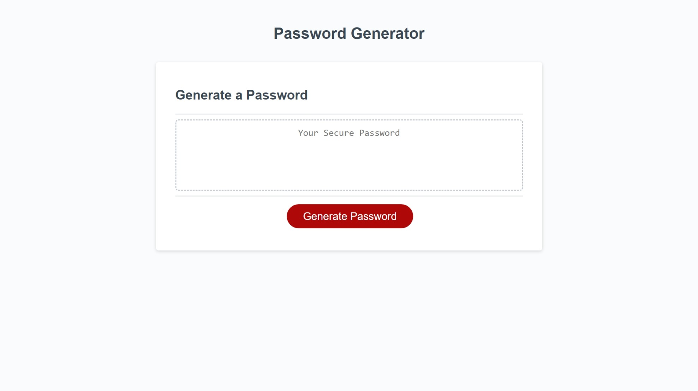

# Password Generator

## Description
This project is designed to generate a password that is between 8 and 128 characters. It first asks for a desired password length, then it will ask which types of characters the user would like to include in their password. This project was designed to practice javascript functions.  It was also an introduction to initializing js functions via a button created via html and css.

Link to site: [https://adamywfong.github.io/03-password-generator/](https://adamywfong.github.io/03-password-generator/).

